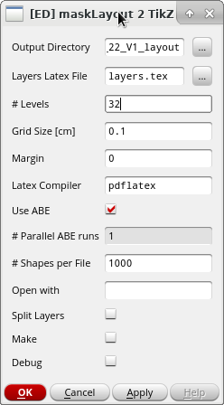

# ml2tikz

*maskLayout* to *tikzpicture* converter for Cadence Virtuoso

## Description

Cadence SKILL function, which can be used to create a *tikzpicture* of 
a *maskLayout*. 
This is especially useful for theses, publications and presentation.

## Installation

The function can be used by loading the SKILL file *EDml2TikZ.il* in 
Cadence Virtuoso:

``` scheme
(load "EDml2TikZ.il")
```

A more convenient way might be to add this load command in the `.cdsinit`.
You can create an additional menu-bar item in the Layout Editor by loading the
file
``` scheme
(load "EDml2TikZUserPostInstallTrigger.il")
```

## Usage

### Command Interpreter Window

The function *EDml2TikZ* must be invoked in the Command Interpreter Window (CIW).

``` scheme
(EDml2TikZ ?sOutDir "~/myExports"  ?sLayersLatexFile "~/myLayerDefinition.tex")
```

The above shown example function call creates a *tikzpicture* of the maskLayout
which is shown in the foreground in a layout editor.
The result will be written to the directory `"~/myExports"`, which must be 
read- and writable.
There, all files will be created.
The path to this directory will be returned by the function.

The function must be provided with a *.tex* file 
(`"~/myLayerDefinition.tex"` in the example above) where all layer purpose 
pairs (LPPs) to be considered in the *tikzpicture* must be defined.

Only LPPs, separated with the vertical bar |, in  a `\tikzstyle` command, are 
considered for export, e.g.

``` tex
\tikzstyle{Metal1|drawing}=[draw=blue,fill=blue, fill opacity=0.5]
```

TikZ offers several possibilities to define different styles, e.g. outline, 
filling, opacity, patterns et cetera.
If you are not familiar with TiKZ, take a look at the 
[manual](https://www.ctan.org/pkg/pgf).

The order of `\tikzstyle` commands in the Layers Latex file is identical 
with the order how the layers are drawn within the *tikzpicture*, so make sure 
that the order is meaningful ,e.g. define Poly before Metal 1 et cetera.

In this *.tex* file additional definitions e.g. other usepackages must be
defined as well.

In the result directory a *Makefile* is created, which contains the compilation
commands needed for compiling the *pdf*.
This *Makefile* can be executed using 

``` bash
make
```

You can parallelize the creation of the *PDF* with

``` bash
make --jobs=<NUM OF PARALLEL RUNS>
```

### GUI

You can open the GUI of this tool with
``` scheme
(EDml2TikZ ?bGraphicalMode t)
```
This tool is added to the Layout Editor under *Export* in the menu bar, if
you loaded the file `EDml2TikZUserPostInstallTrigger.il` previously.
A figure of the GUI is shown below.



There, some [parameters](#Parameters) can be specified.
By pressing *OK* or *Apply* the *tikzpicture* is created.

The field *Open With* can be used to specify the tool which will be used to
open the resulting directory (e.g. *thunar* , *nautilus* , *xterm*, etc.).
If this value is not specified, the resulting directory is shown in a
dialog box.


## Parameters
The function *EDml2TikZ* has several keyword parameters:

`oCellView`

Cellview to be be exported. 
If this parameter is not provided, the current cellview in the
foreground `(geGetWindowCellView)` is used.

`sOutDir`

The output directory, where the *tikzpicture* will be created. 
It must be read- and writable. 
If this parameter is not provided the current directory (.) will be used.

`sLayersLatexFile`

A path to a LaTeX file, where all Layer Purpose Pairs (LPPs) considered
for export must be defined.

` sLatexCompiler `

The LaTeX compiler, which should be used. If this parameter is not
provided *pdflatex* will be used.

` bBox `

Bounding Box, which is used for export.

`nGridSize`

The grid side of the *tikzpicture* in centimeters. If this value is not
provided, *1cm* is used as a default value.

`nMargin`

The margin of the *tikzpicture*.
If this value is not provided, no margin is drawn.

`bAbe`

If this parameter is true, the Advanced Boolean Engine (ABE) is used.
This decreases execution time drastically, with the disadvantage that
only octalinear shapes (90 and 45 degree angles) are considered.
When this feature is disabled, there must be the possibility to create
(temporary) views in the same cell.

`bDebug`

If this parameter is true, the 
[intermediate cellviews](#implementation-details) are not deleted at the end.

`xShapesPerFile`

Due to limited memory, a *tikzpicture* can contain only a limited number of 
shapes.
This parameter can be used to control the maximum number of shapes that are
within one *tikzpicture*. If the maskLayout to be exported contains more shapes
that specified by this parameter, the maskLayout will be splitted automatically
in several TeX files, s.t. the maximum number of shapes per single file is not
exceeded.
The compilation results of the individual TeX files will be merged in a
final *tikzpicture*.

`xShapesPerFile`
Number of levels that are considered for export. This must be an
integer between 0 and 32.

` bSplitLayers `

If this parameter is true, additional *tikzpicture* will be created, 
which contain only single layers.

` bMake `

If this parameter is set true, `make` is executed automatically.

## Examples

In the directory *examples* an example of an exported NAND2 logic gate is added.


## Implementation Details

When ABE is deactivated, the function will first create a copy of the maskLayout. 
Then this copy will be flattened. Another new empty layout is created. 
In this new layout all shapes of interest are copied and merged.

## Dependencies

Needed LaTeX usepackages:

+ [graphicx](https://ctan.org/pkg/graphicx)
+ [tikz](https://www.ctan.org/pkg/pgf)

## Known Issues

Multiple threads for ABE cannot be activated, because Virtuoso will crash.
This is why the field *# Parallel ABE runs* is grayed out.

## License

Copyright (c) 2022, [Reutlingen University](https://www.reutlingen-university.de), [Electronics & Drives](https://www.electronics-and-drives.de/)

Permission is hereby granted, free of charge, to any person obtaining a copy
of this software and associated documentation files (the "Software"), to deal
in the Software without restriction, including without limitation the rights
to use, copy, modify, merge, publish, distribute, sublicense, and/or sell
copies of the Software, and to permit persons to whom the Software is
furnished to do so, subject to the following conditions:

The above copyright notice and this permission notice shall be included in all
copies or substantial portions of the Software.

THE SOFTWARE IS PROVIDED "AS IS", WITHOUT WARRANTY OF ANY KIND, EXPRESS OR
IMPLIED, INCLUDING BUT NOT LIMITED TO THE WARRANTIES OF MERCHANTABILITY,
FITNESS FOR A PARTICULAR PURPOSE AND NONINFRINGEMENT. IN NO EVENT SHALL THE
AUTHORS OR COPYRIGHT HOLDERS BE LIABLE FOR ANY CLAIM, DAMAGES OR OTHER
LIABILITY, WHETHER IN AN ACTION OF CONTRACT, TORT OR OTHERWISE, ARISING FROM,
OUT OF OR IN CONNECTION WITH THE SOFTWARE OR THE USE OR OTHER DEALINGS IN THE
SOFTWARE.